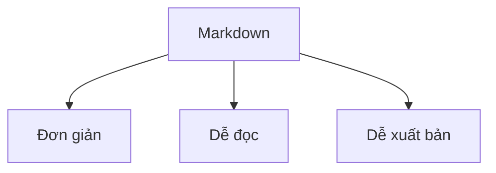

# 📘 Markdown Demo – README.md

Đây là một file **demo** để minh hoạ các quy ước thường dùng trong Markdown.  
Markdown giúp viết tài liệu nhanh gọn, dễ đọc và dễ xuất bản ra HTML/PDF.

---

## 1. Tiêu đề (Headings)

# H1 - Tiêu đề lớn nhất
## H2 - Tiêu đề cấp 2
### H3 - Tiêu đề cấp 3
#### H4 - Tiêu đề cấp 4
##### H5 - Tiêu đề cấp 5
###### H6 - Tiêu đề cấp 6

---

## 2. Định dạng chữ

- **Chữ đậm**  
- *Chữ nghiêng*  
- ~~Gạch ngang~~  
- ***Đậm + nghiêng***  

---

## 3. Danh sách

### Không thứ tự
- Item 1
- Item 2
  - Subitem 2.1
  - Subitem 2.2
- Item 3

### Có thứ tự
1. Bước 1
2. Bước 2
3. Bước 3

### Checklist
- [x] Viết demo Markdown  
- [ ] Kiểm tra chính tả  
- [ ] Xuất file PDF  

---

## 4. Liên kết & Hình ảnh

[🔗 OpenAI Website](https://openai.com)


---

## 5. Blockquote (Trích dẫn)

> Đây là một đoạn quote cơ bản  
> 
> > Quote có thể **lồng nhau**  
> 
> > *Đậm + nghiêng cũng được*

---

## 6. Code

Inline code: `console.log("Hello World");`

Code block:

```javascript
function hello(name) {
  console.log("Hello " + name);
}
hello("Markdown");
```

---

## 7. Bảng (Tables)

| Cột 1 | Cột 2 | Cột 3 |
|-------|-------|-------|
| A     | B     | C     |
| D     | E     | F     |
| G     | H     | I     |

---

## 8. Đường phân cách

---

## 9. Nhấn mạnh & Ghi chú

> ⚠️ **Lưu ý:** Đây chỉ là ví dụ, không phải tài liệu chính thức.  
> ✅ Markdown hỗ trợ emoji nếu nền tảng cho phép.

---

## 10. Nâng cao

### Task list có emoji
- [x] 🚀 Khởi động dự án  
- [ ] 📝 Viết tài liệu  
- [ ] 🔥 Deploy  

### Code highlight khác ngôn ngữ

```python
def greet(name):
    print(f"Hello, {name}")

greet("Markdown")
```

```bash
# Chạy lệnh terminal
git clone https://github.com/example/repo.git
cd repo
npm install
npm run dev
```

---

## 11. Biểu đồ với Mermaid (nếu được hỗ trợ)



---

## 12. Toán học với LaTeX (nếu hỗ trợ)

Inline: $E = mc^2$  

Block:

$$
\int_0^\infty e^{-x^2} dx = \frac{\sqrt{\pi}}{2}
$$

---

## 13. Gắn ảnh có link

[](https://openai.com)

---

## 14. Collapsible (nếu nền tảng hỗ trợ, như GitHub)

<details>
  <summary>Nhấn để mở rộng</summary>

  Đây là nội dung ẩn.  
  Có thể viết **Markdown** trong này luôn.

</details>

---

## 🎉 Kết thúc

Đây là toàn bộ demo **Markdown** cơ bản + nâng cao.  
Bạn có thể copy file này làm `README.md` cho dự án của mình.
